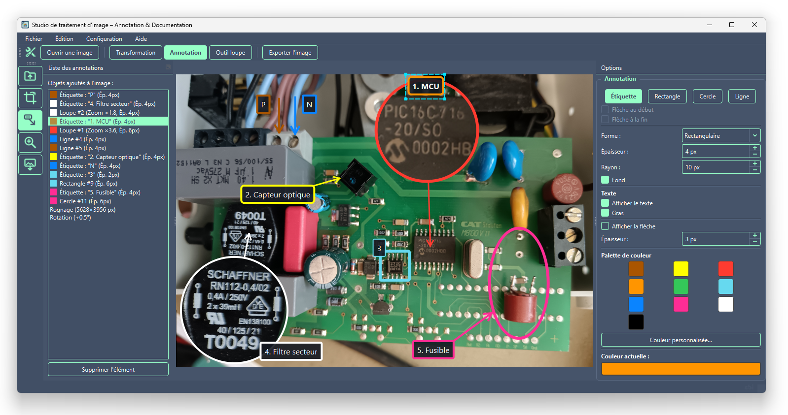

<!--
  File Name: README.md
  Description: Présentation générale, démarrage rapide et index de la documentation d'Image Annotation Tool (IAT).
  Developer: ArnauldDev
  Created Date: 2026-09-08
  Last Modified: 2026-09-27
-->

<!-- Ajouter les badges de développement : -->
<!-- 


 -->

<!-- Badges de statut et version -->


<!-- Badges stack technique -->


<!-- Badges méta -->


<h3>Image Annotation Tool (IAT)</h3>

Application de bureau en Python (**PyQt6** + **Pillow**) pour **annoter, documenter et transformer des photographies techniques et scientifiques**, développée par le **Plateau Technique Mécatronique** du **Centre de Biologie Intégrative (CBI), CNRS / Université de Toulouse**.

## À propos d'IAT

L'application IAT est née d'un constat simple : annoter des photographies d'expériences, réparations électroniques, montages mécatroniques, avec des logiciels de dessin classiques est fastidieux. Ajouter des étiquettes, des zones de mise en valeur ou une loupe sur une image, corriger sa géométrie ou ses couleurs, puis revenir sur un seul détail, oblige trop souvent à reprendre l'ensemble des étapes depuis le début.

IAT répond à ce problème par un principe simple : **l'image originale n'est jamais modifiée**. Chaque opération, ouverture, transformation, annotation, effet de loupe, est enregistrée dans une recette JSON, et l'image finale n'est générée qu'au moment de l'export en JPEG. Cette approche garantit l'intégrité de la source tout en offrant une entière liberté d'expérimentation : chaque réglage peut être repris, ajusté ou annulé sans recommencer le travail, et l'historique complet des traitements reste traçable et reproductible dans le fichier JSON associé.

Concrètement, la barre d'outils reflète ce flux de travail :


**Ouvrir une image** → **Transformation** (géométrie, couleurs) → **Annotation** (étiquettes, zones de mise en valeur) → **Outil loupe** → **Exporter l'image**

Chaque étape reste modifiable à tout moment, ce qui permet de se concentrer sur la qualité de l'annotation scientifique plutôt que sur la répétition de manipulations graphiques.

<a href="https://src.koda.cnrs.fr/cbi-plateau-mecatronique/ressources/image-annotation-tool/-/tree/main/images">
  
</a>

---

<h4><u>Sommaire</u> :</h4>

- [À propos d'IAT](#à-propos-diat)
- [Fonctionnalités principales](#fonctionnalités-principales)
  - [Annotation](#annotation)
  - [Édition](#édition)
  - [Transformation](#transformation)
  - [Fichiers et export](#fichiers-et-export)
  - [Personnalisation](#personnalisation)
- [Démarrage rapide](#démarrage-rapide)
- [Convention de nommage](#convention-de-nommage)
- [Documentation](#documentation)
- [Licence](#licence)
- [Développement assisté par IA (Vibe coding)](#développement-assisté-par-ia-vibe-coding)

---

## Fonctionnalités principales

### Annotation

- Étiquettes texte avec flèche, rectangles, cercles et lignes fléchées ; couleur, épaisseur, coins arrondis, fond, gras…
- **Plusieurs loupes** par image : médaillons circulaires grossissants (1× à 8×, réglable à la molette) reliés à la zone agrandie par une flèche.
- Accrochage à la grille en maintenant **`Ctrl`** ; formes parfaites et angles de 45° avec **`Shift`**.

### Édition

- Liste des objets avec **sélection multiple** (`Shift+clic`, `Ctrl+clic`), ordre des calques par glisser-déposer, suppression (`Suppr`).
- Menu **Édition** : **annuler / rétablir** (`Ctrl+Z` / `Ctrl+Y`, 100 étapes), **copier / coller** (`Ctrl+C` / `Ctrl+V`), supprimer.
- **Clic droit sur l'image** : aligner (par rapport à l'image ou entre objets), distribuer, accrocher à la grille.
- Déplacement direct des objets sur l'image, quel que soit l'outil actif.

### Transformation

- Rotation (±90° et angle fin), grille d'alignement, correction trapézoïdale sur les quatre bords, rognage interactif, luminosité et contraste.

### Fichiers et export

- Ouverture par menu, `Ctrl+O`, **glisser-déposer** d'un fichier image sur la fenêtre, ou historique des fichiers récents.
- Recette `*-iat.json` rechargée automatiquement et **sauvegardée en continu**.
- Export JPEG haute fidélité depuis l'image source pleine résolution, avec **préréglages de largeur 800 / 1200 / 1920 px** ou taille libre (proportions conservées, rééchantillonnage Lanczos).

### Personnalisation

- Menu **Configuration** : fichier `.env`, thèmes, barres d'outils, notification après l'export, chemins des ressources, langue (français / anglais), réinitialisation des paramètres.
- **Thèmes** QSS interchangeables : **CBI** (défaut), **Clair**, **Sombre**, ou votre propre thème.

---

## Démarrage rapide

Prérequis : **Python 3.10 ou supérieur** (3.14 recommandé) et Git.

```bash
# 1. Récupérer les sources
git clone https://src.koda.cnrs.fr/cbi-plateau-mecatronique/ressources/image-annotation-tool.git
cd image-annotation-tool

# 2. Créer et activer un environnement virtuel
python -m venv .venv
.\.venv\Scripts\Activate.ps1          # Windows (PowerShell)
# source .venv/bin/activate           # macOS / Linux

# 3. Installer les dépendances
python -m pip install --upgrade pip
python -m pip install -r requirements.txt

# 4. Lancer l'application
python main.py                        # ou : python -m iat (après pip install -e .)
```

Ensuite : `Fichier > Ouvrir une image` (ou glissez une photo sur la fenêtre), choisissez un outil (`Transformation`, `Annotation`, `Outil loupe`), puis `Exporter l'image`. Le détail est dans le [Guide utilisateur](docs/guide-utilisateur.md).

Pour lancer les tests : `python -m pytest -q`.

Un exécutable autonome (Windows, macOS, Linux) peut être construit avec `python build_exe.py` : voir [Génération de l'exécutable](docs/generation-executable.md).

---

## Convention de nommage

| Type de fichier     | Modèle de nom                 | Exemple                    |
| :------------------ | :---------------------------- | :------------------------- |
| **Image originale** | `nom-de-l-image-raw.jpg`      | `carte-mere-raw.jpg`       |
| **Recette JSON**    | `nom-de-l-image-iat.json`     | `carte-mere-iat.json`      |
| **Export final**    | `nom-de-l-image-iat-x<L>.jpg` | `carte-mere-iat-x1200.jpg` |

Sans suffixe `-raw`, le suffixe `-iat` est simplement ajouté (`photo.png` → `photo-iat.json`). Détails : [Format de la recette JSON](docs/format-recette-json.md).

---

## Documentation

| Document                                                              | Public                        | Contenu                                                                                    |
| :-------------------------------------------------------------------- | :---------------------------- | :----------------------------------------------------------------------------------------- |
| [Guide utilisateur](docs/guide-utilisateur.md)                        | Utilisateurs                  | Fenêtre, outils Transformation / Annotation / Loupe / Export, liste des objets, raccourcis |
| [Configuration](docs/configuration.md)                                | Utilisateurs, administrateurs | Fichier `.env`, variables, menu Configuration, thèmes, langues, préférences                |
| [Format de la recette JSON](docs/format-recette-json.md)              | Développeurs, scripts         | Structure du fichier `*-iat.json`, loupes, ordre des calques, rétrocompatibilité           |
| [Environnement de développement](docs/environnement-developpement.md) | Développeurs                  | Python, environnement virtuel, lancement, tests, organisation du projet                    |
| [Génération de l'exécutable](docs/generation-executable.md)           | Développeurs                  | PyInstaller sous Windows, macOS et Linux, liste de vérification                            |
| [Contribuer](docs/contribuer.md)                                      | Développeurs                  | Branches, messages de commit, conventions de code, tests                                   |
| [GitLab CI/CD](docs/gitlab-ci-cd.md)                                  | Mainteneurs                   | Runners, pipeline test → build → release, branches protégées, merge requests               |
| [Thèmes](themes/README.md)                                            | Tous                          | Créer ou modifier un thème QSS                                                             |
| [Tests](tests/README.md)                                              | Développeurs                  | Bonnes pratiques d'organisation et de rédaction des tests                                  |

---

## Licence

**[Copyright (c) 2026 BIGANZOLI Arnauld, CBI FR 3743 CNRS-UT3](https://cbi-toulouse.fr/plateau-mecatronique/)**

Ce projet est distribué sous licence libre **Apache License 2.0**. Consultez le fichier [`LICENSE`](LICENSE) pour plus d'informations.

---

## Développement assisté par IA (Vibe coding)

Une grande partie de l'architecture et du code de cette application a été générée via une démarche de vibe coding à l'aide d'assistants IA (ex. Claude, ChatGPT, Cursor).

- **Ce qui a été généré :** Code source principal, scripts d'automatisation, tests unitaires.
- **Ce qui a été supervisé :** Validation fonctionnelle, intégration et revue du code.
